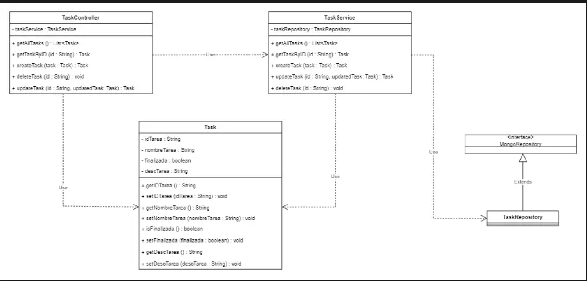
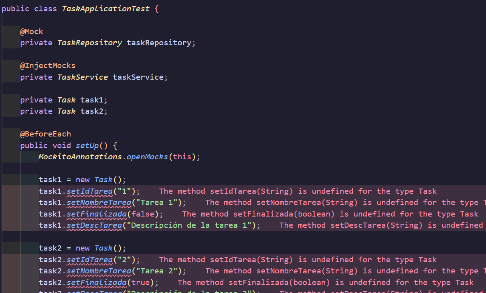
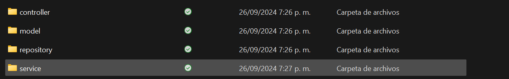
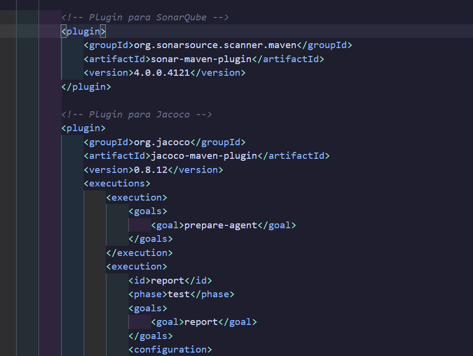
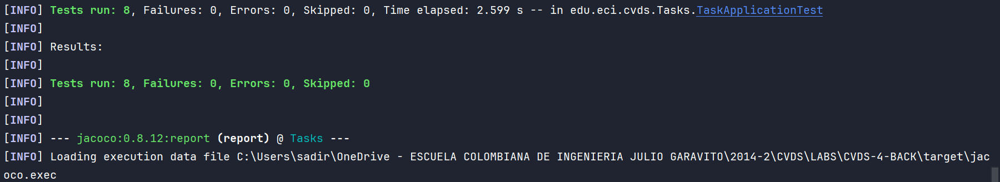
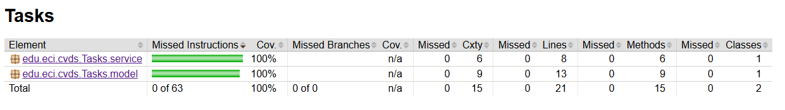
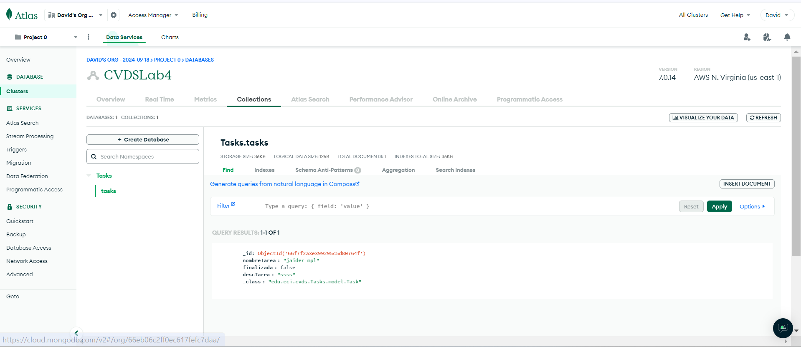

# LABORATORIO 4
## CRUD DE TAREAS
### Integrantes

- Santiago Diaz Rojas
- David Felipe Velasquez
- Sebastian Velasquez
- Santiago Naranjo

## 1. Generar scaffolding del protyecto.

## 2. Generar pruebas.
Para poder aplicar TDD lo primero que se hará serán las pruebas unitarias,
de tal forma que no las creemos para que pasen a conveniencia, aqui se pueden 
ver algunas pruebas y como estas fallan

Adicionalmente usamos herramientas como Mock, InjectMocks y BeforeEach para 
facilitar la creación de pruebas unitarias, ya que esto nos permite simular 
objetos, estas anotaciones vienen de la libreria mockito, adicionalmente se 
hará un setup para las cosas que se usan en cada prueba poniendo la anotación 
BeforeEach

## 3. Generacion de directorios.
Creamos los directorios necesarios para el correcto funcionamiento del proyecto, además de las implementaciones de sonar y jacoco en la carpeta target mediante los plugin puestos en el pom

## 4. Configuracion de validacion de codigo.
Sonar y jacoco plugins, con una covertura del 80%, estas validaciones se hacen
sobre las clases TaskController y TaskService.

## 5. Implementación de clases.
Despues de las configuraciones en el pom.xml procedemos a implementar cada una de las
clases influyentes dentro de la inversion de control e inyeccion de dependencias.

## 6. Ejecucion de pruebas de unidad y validacion estatica de codigo.

## 7. Creacion del cluster en Mongo Atlas

