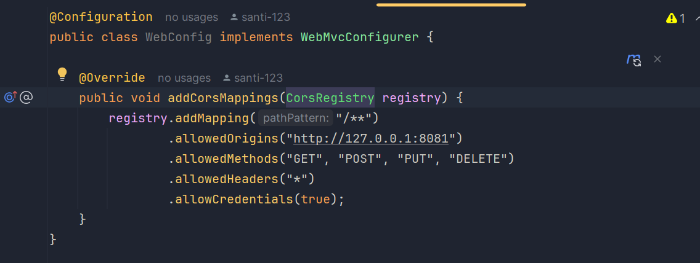
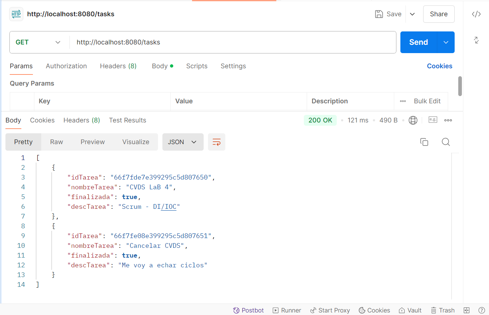
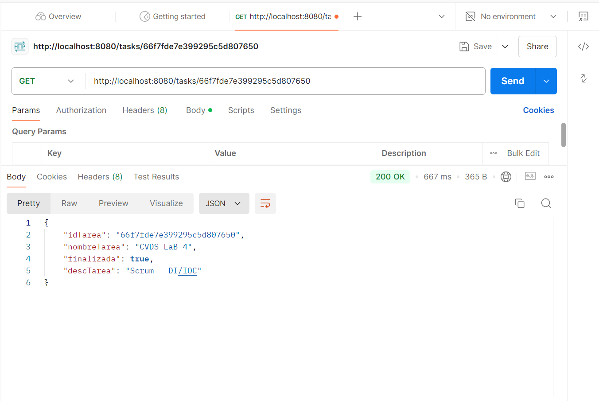
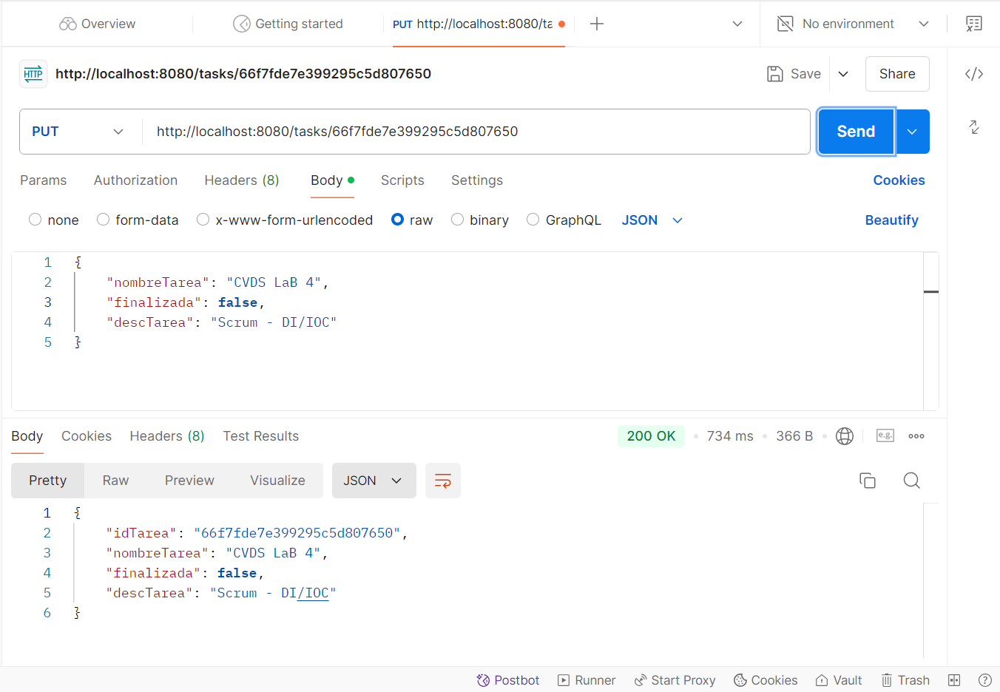
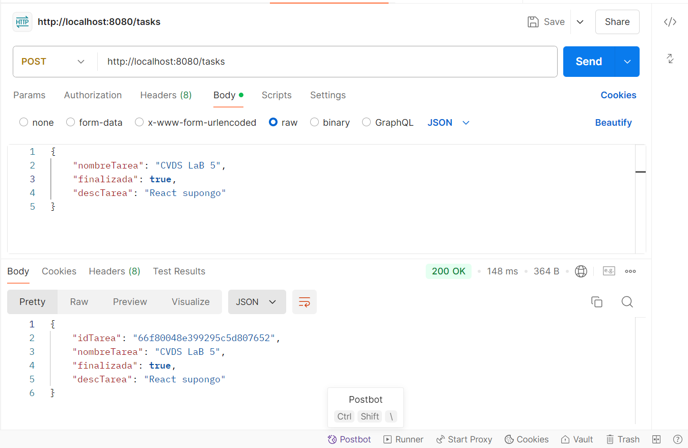
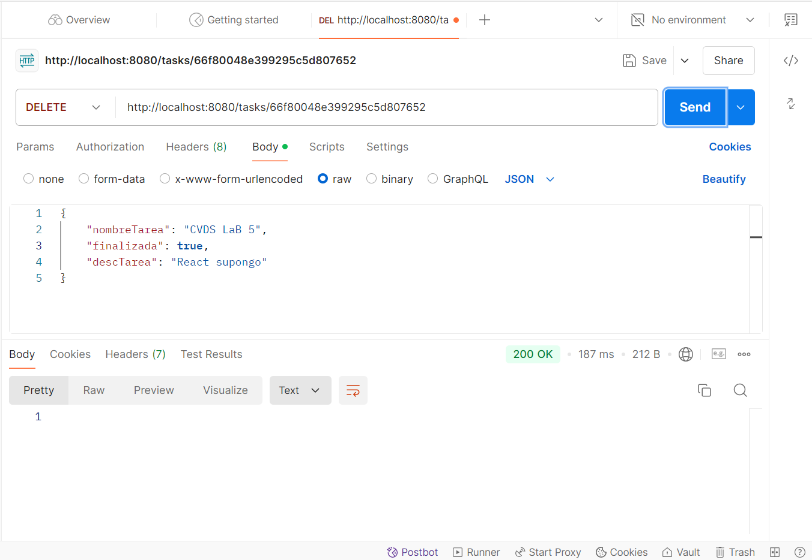

# LABORATORIO 4
## CRUD DE TAREAS BACKEND

### Integrantes

- Santiago Díaz Rojas
- David Felipe Velásquez
- Sebastián Velásquez
- Santiago Naranjo

## 1. Generación del scaffolding del proyecto.

## 2. Generación de pruebas.
Para poder aplicar TDD, lo primero que haremos será crear pruebas unitarias, de tal forma que no las ajustemos para que pasen de forma conveniente. Aquí se pueden ver algunas pruebas y cómo fallan.

Adicionalmente, utilizamos herramientas como `Mock`, `InjectMocks` y `BeforeEach` para facilitar la creación de pruebas unitarias, ya que esto nos permite simular objetos. Estas anotaciones provienen de la librería Mockito. También se hará un setup para los elementos que se usan en cada prueba, utilizando la anotación `BeforeEach`.

## 3. Generación de directorios.
Creamos los directorios necesarios para el correcto funcionamiento del proyecto, además de implementar Sonar y Jacoco en la carpeta `target` mediante los plugins incluidos en el `pom.xml`.

## 4. Configuración de validación de código.
Utilizamos los plugins de Sonar y Jacoco, con una cobertura del 80%. Estas validaciones se aplican sobre las clases `TaskController` y `TaskService`.

## 5. Implementación de clases.
Después de las configuraciones en el `pom.xml`, procedemos a implementar cada una de las clases influyentes dentro de la inversión de control e inyección de dependencias.

## 6. Ejecución de pruebas unitarias y validación estática de código.

## 7. Creación del cluster en MongoDB Atlas.

## 8. Creación de clase de configuración.
Implementación de una clase para permitir realizar solicitudes HTTP desde un puerto local.

## 9. Pruebas en Postman

- Solicitud GET para obtener todas las tareas existentes:
  http://localhost:8080/tasks
  

- Solicitud GET para obtener una tarea existente por su `idTarea`:
  http://localhost:8080/tasks/{idTarea}
  

- Solicitud PUT para actualizar una tarea dado su `idTarea`:
  http://localhost:8080/tasks/{idTarea}
  

- Solicitud POST para la creación de nuevas tareas:
  http://localhost:8080/tasks
  

- Solicitud DELETE para eliminar una tarea dado su `idTarea`:
  http://localhost:8080/tasks/{idTarea}
  
