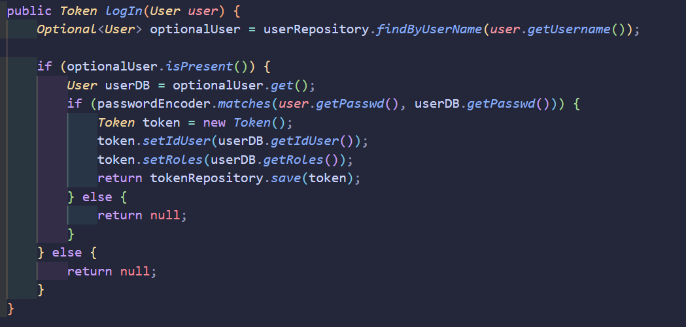

# LABORATORIO 4

## CRUD DE TAREAS BACKEND

### Integrantes

- Santiago Díaz Rojas
- David Felipe Velásquez
- Sebastián Velásquez
- Santiago Naranjo

%20%3A%20List%26amp%3Blt%3BString%26amp%3Bgt%3B%22%20style%3D%22text%3BstrokeColor%3Dnone%3BfillColor%3Dnone%3Balign%3Dleft%3BverticalAlign%3Dtop%3BspacingLeft%3D4%3BspacingRight%3D4%3Boverflow%3Dhidden%3Brotatable%3D0%3Bpoints%3D%5B%5B0%2C0.5%5D%2C%5B1%2C0.5%5D%5D%3BportConstraint%3Deastwest%3BwhiteSpace%3Dwrap%3Bhtml%3D1%3B%22%20vertex%3D%221%22%20parent%3D%221%22%3E%3CmxGeometry%20x%3D%222170%22%20y%3D%22370%22%20width%3D%22410%22%20height%3D%2224%22%20as%3D%22geometry%22%2F%3E%3C%2FmxCell%3E%3C%2Froot%3E%3C%2FmxGraphModel%3E)

## 1. Generación del scaffolding del proyecto.

## 2. Generación de pruebas.

Para poder aplicar TDD, lo primero que haremos será crear pruebas unitarias, de tal forma que no las ajustemos para que pasen de forma conveniente. Aquí se pueden ver algunas pruebas y cómo fallan.

Adicionalmente, utilizamos herramientas como `Mock`, `InjectMocks` y `BeforeEach` para facilitar la creación de pruebas unitarias, ya que esto nos permite simular objetos. Estas anotaciones provienen de la librería Mockito. También se hará un setup para los elementos que se usan en cada prueba, utilizando la anotación `BeforeEach`.

## 3. Generación de directorios.

Creamos los directorios necesarios para el correcto funcionamiento del proyecto, además de implementar Sonar y Jacoco en la carpeta `target` mediante los plugins incluidos en el `pom.xml`.

## 4. Configuración de validación de código.

Utilizamos los plugins de Sonar y Jacoco, con una cobertura del 80%. Estas validaciones se aplican sobre las clases `TaskController` y `TaskService`.

## 5. Implementación de clases.

Después de las configuraciones en el `pom.xml`, procedemos a implementar cada una de las clases influyentes dentro de la inversión de control e inyección de dependencias.

## 6. Ejecución de pruebas unitarias y validación estática de código.

Tambien quedo la prueba realizada en sonar

## 7. Creación del cluster en MongoDB Atlas.

## 8. Creación de clase de configuración.

Implementación de una clase para permitir realizar solicitudes HTTP desde un puerto local.

## 9. Pruebas en Postman

- Solicitud GET para obtener todas las tareas existentes:
  http://localhost:8080/tasks
  

- Solicitud GET para obtener una tarea existente por su `idTarea`:
  http://localhost:8080/tasks/{idTarea}
  

- Solicitud PUT para actualizar una tarea dado su `idTarea`:
  http://localhost:8080/tasks/{idTarea}
  

- Solicitud POST para la creación de nuevas tareas:
  http://localhost:8080/tasks
  

- Solicitud DELETE para eliminar una tarea dado su `idTarea`:
  http://localhost:8080/tasks/{idTarea}
  

## 10. Herramienta de gráficas
Para los histogramas pedidos usamos la herramienta de chart.js, que permite la creación de gráficos interactivos. 

Esta herramienta es bastante intuitiva y facil de usar, también tiene gráficos atractivos para el usuario además de permitirles interactuar mediante herramientas como el "hover" usado en css y son adaptables a las diferentes pantallas

Las partes malas de usar chart.js es que tiene personalizacion limitada y no es tan fácil de escalar para datos muy complejos y gráficos 3d, por lo tanto para graficación simple es una buena herramienta por su facilidad de uso

## 11. Configuracion de seguridad
Primero hicimos la configuracion para encriptar las contraseñas de los usuarios en la base de datos, esto mediante la modificación del método para crear los usuarios, donde usando PasswordEncoder del propio Spring seteamos la contraseña mediante .encode() así:

Ahora las contraseñas se ven en la base de datos de la siguiente forma:

Por esto mismo se tuvo que hacer una modificación en el proceso del login para que el usuario no tuviera que insertar su contraseña encriptada para poder acceder, esto se hace mediante un método de PasswordEncoder llamado .matches() como se ve a continuación:

Continuando con la configuración de seguridad, vemos la configuración web, la cual permitimos que se pudiera hacer cualquier tipo de petición, ya que el que se encarga de las revision de los roles será el front, por lo tanto de lo único que se encarga este método es de el codificador y de dar autoridades a los usuarios

Se modifica la clase User para que ahora tenga una lista de roles:

Se modificó a su vez el token para que contenga los roles en una lista, ya que el token es el que se usa en el front para garantizar el inicio de sesión

Adicionalmente se crearon 2 servicios nuevos, uno para poder añadir roles a un usuario en específico y otro para obtener los roles del usuario en específico

Finalizando con la seguridad, miramos como se hizo el certificado autofirmado

Primero usamos el comando: keytool -genkeypair -alias miproyecto -keyalg RSA -keysize 2048 -storetype PKCS12 -keystore miproyecto.p12 -validity 3650, el cual nos genera un archivo con extensión .p12 y el alias que le hayamos querido poner, validez de 3650 días y de peso de 2048 bits, el tipo de almacenamiento de claves que elgimos, es decir PKCS12. Este documento que es ya el certificado autofirmado lo guardamos en la ruta C:\Users\sebas\Desktop\CVDS LABS\CVDS-4-BACK\src\main\resources para que tenga efecto y adicionalmente añadimos algunas cosas en application.properties del proyecto, estas cosas que añadimos fueron:

Donde se debe poner información que nos piden a la hora de hacer el certificado

Finalmente ejecutamos el comando mvn spring-boot:run para ejecutar de nuevo el proyecto pero esta vez en el puerto 8443, que fue elegido por nosotros, y estará corriendo en la URL https://localhost:8443, así que el front deberá hacer solicitudes a esta misma.
