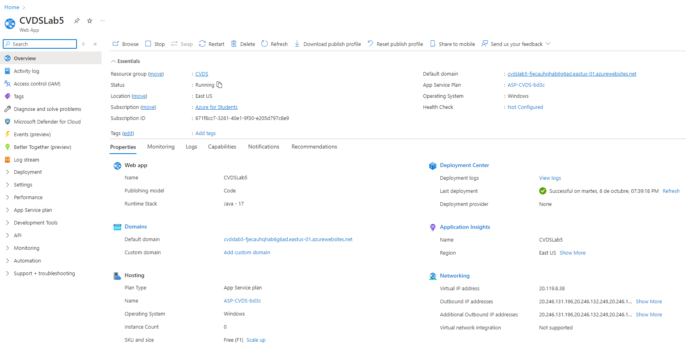

# LABORATORIO 4

## CRUD DE TAREAS BACKEND

### Integrantes

- Santiago Díaz Rojas
- David Felipe Velásquez
- Sebastián Velásquez
- Santiago Naranjo

## 1. Generación del scaffolding del proyecto.

## 2. Generación de pruebas.

Para poder aplicar TDD, lo primero que haremos será crear pruebas unitarias, de tal forma que no las ajustemos para que pasen de forma conveniente. Aquí se pueden ver algunas pruebas y cómo fallan.

Adicionalmente, utilizamos herramientas como `Mock`, `InjectMocks` y `BeforeEach` para facilitar la creación de pruebas unitarias, ya que esto nos permite simular objetos. Estas anotaciones provienen de la librería Mockito. También se hará un setup para los elementos que se usan en cada prueba, utilizando la anotación `BeforeEach`.

## 3. Generación de directorios.

Creamos los directorios necesarios para el correcto funcionamiento del proyecto, además de implementar Sonar y Jacoco en la carpeta `target` mediante los plugins incluidos en el `pom.xml`.

## 4. Configuración de validación de código.

Utilizamos los plugins de Sonar y Jacoco, con una cobertura del 80%. Estas validaciones se aplican sobre las clases `TaskController` y `TaskService`.

## 5. Implementación de clases.

Después de las configuraciones en el `pom.xml`, procedemos a implementar cada una de las clases influyentes dentro de la inversión de control e inyección de dependencias.

## 6. Ejecución de pruebas unitarias y validación estática de código.

Tambien quedo la prueba realizada en sonar

## 7. Creación del cluster en MongoDB Atlas.

## 8. Creación de clase de configuración.

Implementación de una clase para permitir realizar solicitudes HTTP desde un puerto local.

## 9. Pruebas en Postman

- Solicitud GET para obtener todas las tareas existentes:
  http://localhost:8080/tasks
  

- Solicitud GET para obtener una tarea existente por su `idTarea`:
  http://localhost:8080/tasks/{idTarea}
  

- Solicitud PUT para actualizar una tarea dado su `idTarea`:
  http://localhost:8080/tasks/{idTarea}
  

- Solicitud POST para la creación de nuevas tareas:
  http://localhost:8080/tasks
  

- Solicitud DELETE para eliminar una tarea dado su `idTarea`:
  http://localhost:8080/tasks/{idTarea}
  

## 10. Herramienta de gráficas

Para los histogramas pedidos usamos la herramienta de chart.js, que permite la creación de gráficos interactivos.

Esta herramienta es bastante intuitiva y facil de usar, también tiene gráficos atractivos para el usuario además de permitirles interactuar mediante herramientas como el "hover" usado en css y son adaptables a las diferentes pantallas

Las partes malas de usar chart.js es que tiene personalizacion limitada y no es tan fácil de escalar para datos muy complejos y gráficos 3d, por lo tanto para graficación simple es una buena herramienta por su facilidad de uso

# Laboratorio 5

## Jobs

En primer lugar integramos una accion en github para que cuando se hace un push en el repositorio, se ejecute una tarea que se encarga de hacer un build y desplegar el proyecto en azure.

## Integración continua

En segundo lugar hacemos toda la configuracion necesaria para configurar el azure, seguimos el tutorial de azure para configurar la integración continua.

Primero lo creamos para que sea compatible con el proyecto de maven, luego configuramos el pipeline para que se ejecute cuando se hace un push en el repositorio, y finalmente configuramos el azure para que se ejecute el build y desplegar el proyecto.

Una vez que se ha configurado la integración continua, se puede ver que se ejecuta cada vez que se hace un push en el repositorio.

## Nuevas funcionalidades

Para crear las nuevas dificultades para las tasks, se modifico el modelo y los demas archivos para que se puedan crear tareas con diferentes dificultades.

En el servicio de tasks, se modifico el codigo para que se puedan crear tareas con diferentes dificultades automaticamente.

# Laboratorio 6

## Autenticación

Para implementar la autenticacion de usuarios, se crearon los servicios de autenticacion y de usuarios, y se modifico el codigo de la aplicacion para que se puedan crear usuarios y autenticar con ellos.

Se creo un AuthController que se encarga de manejar las peticiones de autenticacion, basicamente se recibe un usuario y contraseña y se valida si son correctos, si son correctos se crea un token y se devuelve, si no se devuelve null.

Con este token se puede acceder a las funcionalidades de la aplicacion, como crear tareas, cambiar estados, etc. Pero todos acorde con el token para poder acceder a las funcionalidades.

Con ello se crearon dos nuevos elementos en mongo, ya que ahora existen sesiones de usuarios y los mismos usuarios, se pueden crear sesiones de usuarios y se pueden eliminar sesiones de usuarios. Para manejar estilo login y logout, se modifico el codigo de la aplicacion para que se puedan crear y eliminar sesiones de usuarios.

Ademas ahora cada task tiene un idUser, esto es para que cada task tenga un usuario asociado, y se puedan cambiar las tareas de un usuario en particular.

Todo junto con pruebas unitarias, se puede ver que se pueden crear y eliminar sesiones de usuarios.

# Laboratorio 8

## Seguridad
